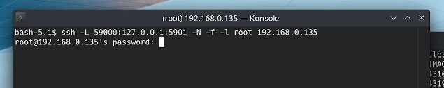
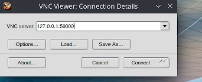

# Dockerized Ubuntu + XFCE

---
### /!\ WARNING /!\
---
Replace **"123badpassword"** with a strong password in the *Dockerfile*.

### Building
___
`docker build -t ubuntu-xfce .`

### Running
___
`docker run -dp 5901:5901 -p 22 ubuntu-xfce`

---
## Using SSH Tunnel to Connect
----
Since VNC uses plaintext for passwords, it is recommended to use SSH tunnel to establish remote connection. That is is what we have used in here.

### Creating SSH Tunnel

`ssh -L 59000:127.0.0.1:5901 -N -f -l edward 192.168.0.135`

Replace **192.168.0.135** with Docker machine IP address.

Now, use your favorite VNC viewer.

Then, enter the password as mentioned in Dockerfile on the same line containing **vncpasswd**.